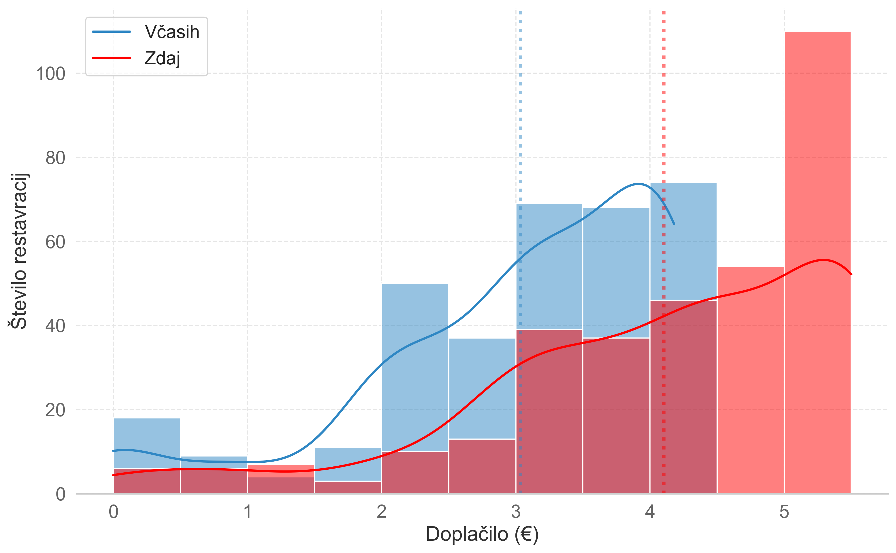
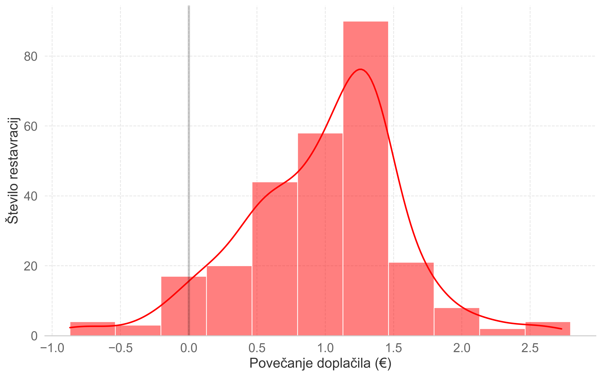

# Analysis of Changes in Student Food Prices 2022-23

Welcome to this repository, which provides a script to scrape data from [Študentska prehrana](https://www.studentska-prehrana.si/sl/restaurant), a website that lists restaurants that offer discounted meals to students in Slovenia. The script retrieves data from the Internet Archive to compare the prices of meals in June 2022 with the current prices listed on the website. The data is cleaned and merged into a single dataframe for further analysis.

In addition to the script, this repository also includes a Jupyter notebook [`overview.ipynb`](overwiev.ipynb) that calculates various statistics on the data, and [`histograms.ipynb`](histograms.ipynb) that plots histograms of the price changes (see them inside folder [`plots`](plots)).

I use the data as a basis for [Boni 23](https://kmecl.tk/boni23) website (repo [here](https://github.com/timkmecl/boni23))

## Data

The repository contains the following data files:

- [`restavracije.csv`](data/restavracije.csv) - A CSV file with restaurant data (can be opened in Excel)
- [`restavracije.json`](data/restavracije.json) - A JSON file with restaurant data

 ## Usage

You can import the functions from the scraper module and use them in your own scripts as follows:

```python
from scraper import load_data, merge_data

df_new, df_old = load_data()
df = merge_data(df_new, df_old)
```

Alternatively, you can run the script directly:

```bash
python scraper.py
```

This will save the data to both a CSV and a JSON file in the `/data` directory.

## Plots
### Histogram of prices then and now
	

### Histogram of price increases
